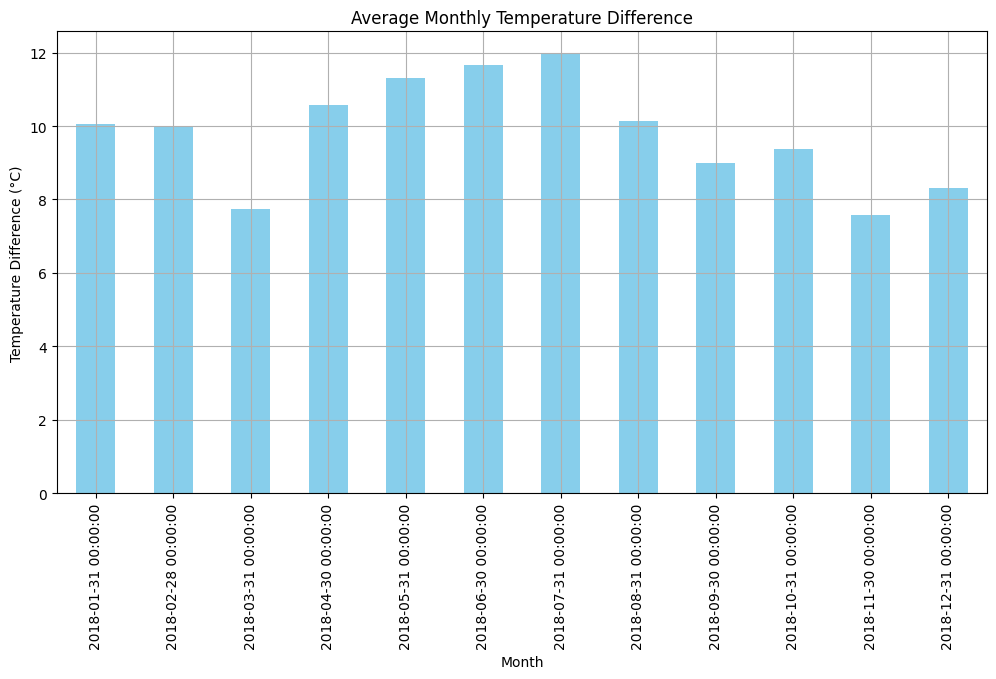
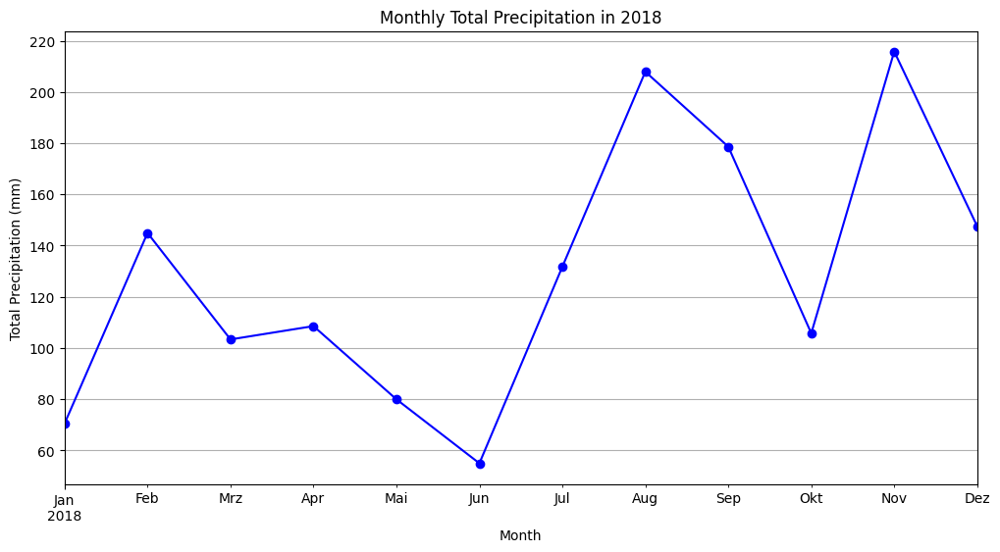
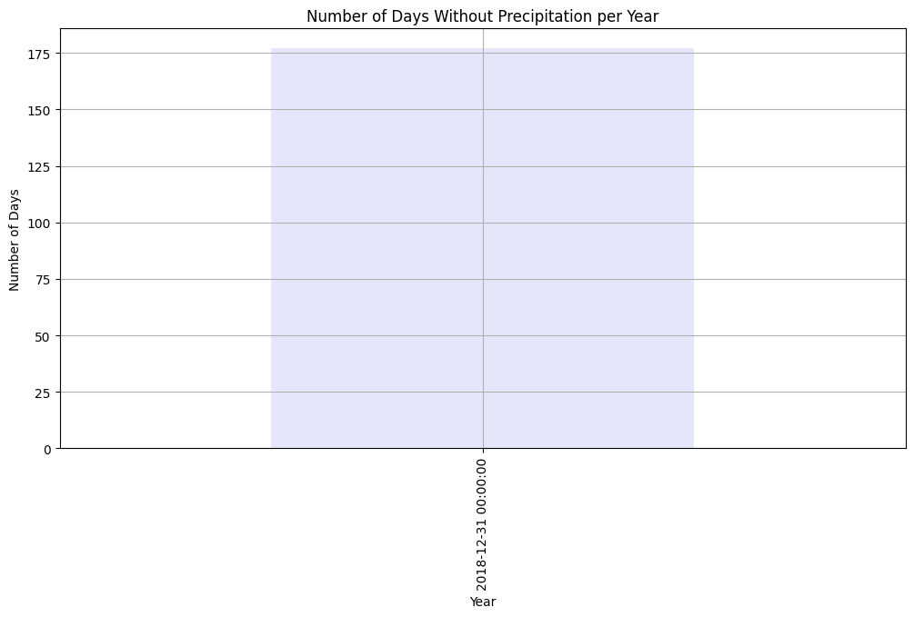
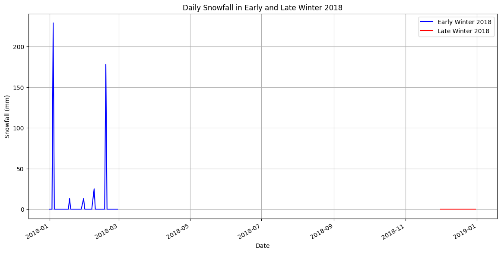

# Weather Data Analysis Project

This project involves analyzing weather data from a dataset to perform various data cleaning and analysis tasks. The dataset includes information on precipitation, snowfall, temperature, and other weather-related metrics.

## Table of Contents

- [Weather Data Analysis Project](#weather-data-analysis-project)
  - [Table of Contents](#table-of-contents)
  - [Installation](#installation)
  - [Data Preparation](#data-preparation)
  - [Analysis](#analysis)
    - [Temperature Data Analysis](#temperature-data-analysis)
    - [Precipitation Data Analysis](#precipitation-data-analysis)
    - [Snowfall Data Analysis](#snowfall-data-analysis)
  - [Results](#results)

## Installation

To run the scripts in this project, you'll need to have Python installed along with the following libraries:

- pandas
- numpy
- matplotlib

You can install these libraries using pip:

```bash
pip install pandas numpy matplotlib
```

## Data Preparation

1. Load the dataset `dirty_data.csv` and convert the `date` column to DateTime format.
2. Set the `date` column as the index.
3. Ensure relevant columns are numeric and handle any invalid data.
4. Clean the `SNOW` column by replacing NaN values with 0.

## Analysis

### Temperature Data Analysis

**Data Preparation:**

- Load the dataset and prepare the date column.
- Set the date column as the index.

**Cleaning Temperature Values:**

- Identify and replace obvious errors in temperature values (`TMAX`, `TMIN`) with NaN or another appropriate value.
- Replace missing values in the temperature columns (`TMAX`, `TMIN`, `TOBS`) with the mean of the ±4 days before/after.

**Monthly Temperature Difference:**

- Create a new column `Temp_Difference` representing the difference between `TMAX` and `TMIN`.
- Calculate the average temperature difference for each month and visualize the results in a bar chart.

**Highest and Lowest Temperatures:**

- Identify the day with the highest and lowest temperature (`TMAX` and `TMIN`) in the year 2018.
- Visualize the daily maximum and minimum temperatures for the year 2018 in a line chart.

### Precipitation Data Analysis

**Monthly Total Precipitation:**

- Calculate the monthly total precipitation (`PRCP`) for the year 2018.
- Visualize the monthly total precipitation in a line chart.

**Days Without Precipitation:**

- Determine the number of days without precipitation (`PRCP = 0`) for each year in the dataset.
- Visualize the number of days without precipitation per year in a bar chart.

### Snowfall Data Analysis

**Winter Analysis:**

- Calculate the total snowfall (`SNOW`) for the winter of early 2018 and late 2018 (December to February).
- Determine the maximum snow depth (`SNWD`) and the corresponding day.

## Results

**Monthly Temperature Difference:**



**Daily Maximum and Minimum Temperatures in 2018:**


**Monthly Total Precipitation in 2018:**



**Number of Days Without Precipitation per Year:**



**Daily Snowfall in Early and Late Winter 2018:**


